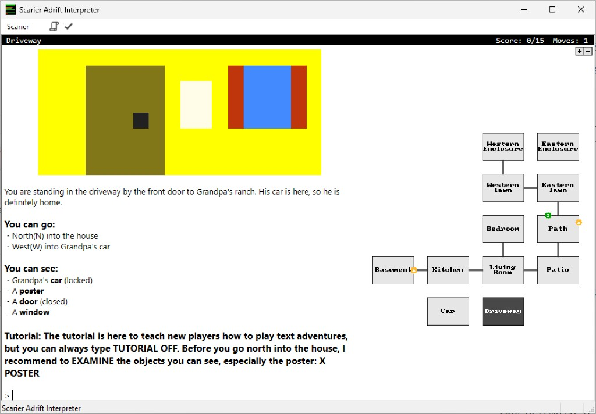

# Windows Scarier

Windows Scarier is an interpreter for interactive fiction (text adventure games) written in [ADRIFT](https://www.adrift.co/).

It's based on Spatterlight's [Scarier](https://github.com/angstsmurf/spatterlight/tree/master/terps/scarier), linked against David Kinder's
[Windows Glk](https://github.com/DavidKinder/Windows-Glk) and built with Visual Studio.



## Building

Download and install Visual Studio Community edition from https://visualstudio.microsoft.com/. In the installer, under "Workloads", make sure that "Desktop development with C++" is selected, and under "Individual components" that "C++ MFC for x64/x86 (Latest MSVC)" is selected.

You'll also need to install Git for Windows. https://git-scm.com/install/windows

Then, from an ordinary Command Prompt or PowerShell window (no Visual Studio
developer prompt needed; the script finds Visual Studio itself):

First, close the repository like this:

```
git clone --recurse-submodules https://github.com/dfabulich/Windows-Scarier.git
```

(Note that this project uses git submodules. When pulling the latest version, you might need to run `git submodule update --init --recursive` to update submodules.)

Once the clone finishes, you can run:

```
cd Windows-Scarier
.\build.cmd
```

That produces `bin\Release\Scarier.exe`, a self-contained executable with Windows Glk linked in. Run `.\build.cmd` again to rebuild. It takes `-Configuration Debug` (default `Release`), `-Rebuild` to build from scratch, and `-Clean` to delete the outputs. After the first build you can also open `WinScarier.sln` in Visual Studio and build the `Release|x86` configuration from there.

Windows Glk is 32-bit only, so Scarier is built 32-bit too.

## License

Windows Scarier is licensed under the GNU General Public License, version 2. See [LICENSE](LICENSE).
